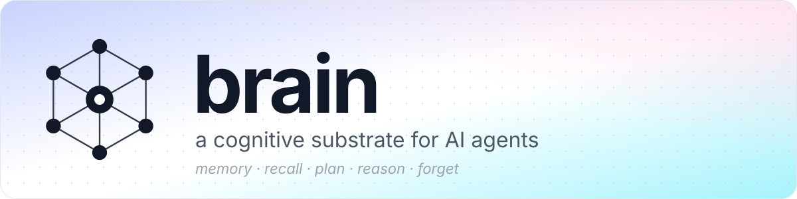

<p align="center">
  
</p>

<p align="center">
  <a href="LICENSE"></a>
  <a href="#status"></a>
  <a href="#tech-stack"></a>
  <a href="#platform-support"></a>
  <a href="spec/"></a>
</p>

# Brain

> **A memory database for AI agents.** Stores four record types — Memory, Entity, Statement, Relation — with explicit provenance, confidence, and bi-temporal validity. Fused retrieval (semantic + lexical + entity-graph + temporal) combined with weighted rank fusion. One Rust core, one wire protocol, one schema. Apache 2.0.

```text
$ brain-server --config config/dev.toml
─────────────────────────────────────────────────────────────────────────────
  ◉ brain-server  v0.1.0  ·  listening 127.0.0.1:9090 (wire) · :9092 (admin)
  ◉ p99 recall 4.2ms  ·  WAL synced  ·  HNSW warm
  ◉ schema: brain:core + acme:sales (2 namespaces, 14 types)
─────────────────────────────────────────────────────────────────────────────

# Brain ships no client. Any language speaks the binary wire protocol (§04)
# directly — CBOR payloads, documented per-opcode field schemas. Conceptually:

ENCODE  "Had a difficult conversation with Alex about the project"
  → ENCODED                                          LSN 1 · s1/m1/v1 ·  9 ms

RECALL  "conflicts with Alex"  top_k=5
  # → ranked by semantic similarity, edge proximity, recency, and salience
  #   — not just vector distance.

# RECALL always fuses semantic + lexical + entity-graph via RRF — one
# read path. The typed graph is always live; declaring your own entity
# and relation types extends entity-anchored traversal to your vocabulary.
RECALL  "what's Priya working on?"
```

---

## Table of contents

- [Why Brain](#why-brain)
- [What Brain stores](#what-brain-stores)
- [Schema is always on](#schema-is-always-on)
- [Quickstart](#quickstart)
- [Cognitive operations](#cognitive-operations)
- [Architecture in 30 seconds](#architecture-in-30-seconds)
- [Performance targets](#performance-targets)
- [Status](#status)
- [Future scope](#future-scope)
- [Documentation](#documentation)
- [Repository layout](#repository-layout)
- [Tech stack](#tech-stack)
- [Platform support](#platform-support)
- [Contributing](#contributing)
- [License](#license)

---

## Why Brain

Today's agent stacks duct-tape four or five storage systems: a vector database for similarity, a graph database for relationships, a full-text store for keyword matching, an LLM extraction pipeline, plus an orchestration layer that pretends to keep them consistent. Half of that orchestration is reinventing transaction semantics across systems that don't agree on what "committed" means.

Brain collapses the stack into one Rust core with one wire protocol and one schema:

- **Cognitive verbs, not CRUD.** `encode` / `recall` / `plan` / `reason` / `forget` are the primitive operations.
- **Fused retrieval out of the box.** Three retrievers (semantic / lexical / graph) combined via weighted RRF — not "top-k by cosine."
- **Provenance is first-class.** Every typed claim carries an evidence list back to source memories, plus four bi-temporal timestamps.
- **Predictable tail latency.** Thread-per-core (Glommio + `io_uring`), single-writer-per-shard, lock-free reads, group-commit WAL.
- **Apache 2.0, end to end.** No premium edition, no SaaS lock-in. The typed graph, the extractor pipeline, the reranker, and the schema DSL are all in the open repo.

The architectural justification, the five design wedges, and the comparison with adjacent systems (Pinecone, Qdrant, Neo4j, Mem0, Letta, Zep) are in [`spec/01_architecture/`](spec/01_architecture/00_purpose.md).

---

## What Brain stores

Four record types, one database:

| Record | What it is | Example |
|---|---|---|
| **Memory** | Raw experience — text + 384-dim embedding + salience + edges + provenance | `"Alex pushed the deadline to next Friday"` |
| **Entity** | Canonical noun with a stable UUIDv7 identity, alias list, and typed attributes | `Person(canonical_name="Alex Chen", aliases=["Alex"])` |
| **Statement** | Typed claim about entities — `Fact` / `Preference` / `Event` — with confidence and bi-temporal validity | `Event(subject=alex, predicate=pushed, object="deadline to Friday", valid_from=t0, confidence=0.92)` |
| **Relation** | Typed binary edge between entities, with cardinality and evidence | `reports_to(alex, priya)` |

Entities, Statements, and Relations are derived from Memories by a three-tier extractor pipeline (pattern → GLiNER classifier → LLM with prompt cache). The pipeline runs on every shard; a candidate persists only if its type is declared in an active schema. The seeded `brain:` system schema is always present, and declaring your own types (below) widens what gets admitted.

The full data model is in [`spec/02_data_model/`](spec/02_data_model/00_purpose.md).

---

## Schema is always on

Schema is not a mode you switch into — it is active from byte zero. Every shard seeds the reserved `brain:` system namespace, so the full pipeline (typed extraction, entity/statement/relation writes, entity-anchored retrieval) runs on every deployment. There is no memory-only mode to opt out of and no runtime gate that turns the typed graph on.

What a schema controls is **admission**, not activation. A write — explicit or extractor-driven — persists a typed row only if its entity type, predicate, or relation type is declared in some active schema; the seeded system namespace is always one of them. Declaring your **own** types is optional and purely additive: `SCHEMA_UPLOAD` merges your declarations into the active set, widening what gets admitted and enabling typed queries over your vocabulary. It never gates any retrieval, extraction, or index path.

| Posture | What persists | Use it when |
|---|---|---|
| **System schema only** (default) | Extraction runs, but only candidates matching the seeded `brain:` types are admitted; everything is recallable as memory + whatever the system types cover. | Prototyping; semantic memory without a domain vocabulary; small agents. |
| **Your types declared** | All of the above + your entity/statement/relation types admitted, so extraction persists domain rows and entity-anchored queries range over your graph. | Production agents that need provenance, temporal reasoning, supersession, or entity-anchored queries over your own vocabulary. |

You can declare types at any time; a declaration after months of use kicks off a backfill over already-stored memories. Declaring your own vocabulary is first-class, not a heavier "mode."

The DSL is documented in [`spec/03_schema/`](spec/03_schema/00_purpose.md). Example:

```text
namespace acme

define entity_type Person {
    attributes {
        email:    text optional unique
        team:     text optional
        timezone: text optional
    }
}

define predicate prefers {
    kind:   Preference
    object: Value<text>
}

define relation_type reports_to {
    from:        Person
    to:          Person
    cardinality: many-to-one
}

define extractor preferences {
    kind:                 llm
    target:               statement Preference
    trigger:              on encode where memory.kind = episodic
    model:                "gpt-4o-mini"
    confidence_threshold: 0.7
    cache:                enabled
}
```

---

## Quickstart

**Requires:** Docker, [`@devcontainers/cli`](https://github.com/devcontainers/cli) (`npm install -g @devcontainers/cli`).

```bash
git clone https://github.com/arc-labs-ai/brain-db
cd brain-db
just docker-up            # builds image, starts container, runs post-create
just docker-shell         # bash inside the dev container
```

Inside the container:

```bash
just verify                                            # fmt + build + clippy + nextest + doctests
export BRAIN__LLM__API_KEY=sk-...                      # REQUIRED — Brain refuses to boot without an LLM key
cargo run --bin brain-server -- --config config/dev.toml   # the database
curl -s http://127.0.0.1:9091/healthz                  # liveness (public)
curl -s http://127.0.0.1:9091/readyz                   # readiness — 200 when all shards serve, 503 otherwise
curl -s http://127.0.0.1:9092/v1/stats                 # admin via curl (loopback)
```

**An LLM provider key is mandatory.** Write-time HyPE (hypothetical-question generation) is always-on and the write path (entity / statement / relation extraction) is built on it — there is no substrate-only mode. The server hard-fails at startup if `[llm] api_key` is empty; set `BRAIN__LLM__API_KEY` and point `[llm] model` at a provider you hold a key for. This is independent of the `[extractors.llm] enabled` tier flag: disabling that tier skips LLM-based extraction but does not remove the boot requirement.

Tests run under [`cargo-nextest`](https://nexte.st) (`just test`); doctests stay on `cargo test --doc`. Some tests are `#[ignore]`-gated (need a real model, a live API key, or are long/perf gates) — run them with `cargo nextest run --run-ignored all`.

One binary:

- **`brain-server`** — the database. Binary wire protocol on the data port; a loopback HTTP admin listener (stats, snapshots, audit, worker control) reachable with `curl`. Brain ships no client/SDK/CLI — speak the wire protocol from any language; a `brainctl` migration tool is future work.

Authentication is mandatory. A connection presents an API key at handshake; the server resolves it to a `(namespace, agent, permissions)` scope from the key's own record. Identity is never client-claimed — the `agent_id` a request operates under comes entirely from the authenticated key, not from a field the client sets.

**Memory is strictly isolated per agent.** `RECALL` returns only the calling agent's own memories — there is no wire field, flag, or shared view that widens a read to another agent. One tenant can never see another's data. Each hit still carries its owning `agent_id` so provenance stays legible.

---

## Cognitive operations

The verbs that drive Brain. Full semantics are in [`spec/05_operations/`](spec/05_operations/00_purpose.md).

| Verb | What it does |
|---|---|
| **ENCODE** | Store an experience. Embeds the text, picks a slot, writes the WAL record, updates metadata, inserts into HNSW. With a schema declared, queues extractors. |
| **RECALL** | Find memories relevant to a cue. Fans out to the semantic, lexical, and graph retrievers and fuses them by RRF — one read path. A declared schema adds entity-anchored typed-graph enrichment. |
| **PLAN** | Construct a path from one cognitive state to another. Pull-based executor with budgets (steps, wall time, branches). |
| **REASON** | Multi-hop traversal explaining why X is connected to Y. Returns the path, evidence memories, and confidence. |
| **FORGET** | Soft (mark + grace period) or hard (zero the slot) tombstoning. Cascades to derived typed-graph records when a schema is active. |
| **LINK** / **UNLINK** | Manually assert / retract a typed edge between two memories. |
| **SUBSCRIBE** | Stream events: memory created, statement created, extractor failed, schema updated, etc. |
| **TXN_BEGIN** / **TXN_COMMIT** / **TXN_ABORT** | Group multiple operations into one atomic unit. |

One-shot mode (each invocation runs a single verb and exits):

```bash
brain encode "Alex pushed the deadline to next Friday"
brain recall "when did Alex change the deadline?" --top-k 5 --include-text
brain plan "current sprint state" "feature shipped" --max-steps 8
brain forget s1/m18/v1 --mode soft
```

Or the same inside the REPL — no `brain` prefix:

```text
brain> encode "Alex pushed the deadline to next Friday"
brain> recall "when did Alex change the deadline?" --top-k 5
brain> reason "Alex changed the deadline" --depth 3
brain> subscribe --kind episodic --collect 10
```

Encoding the same content twice is a no-op by default — pass `--allow-duplicate` to write a fresh copy.

---

## Architecture in 30 seconds

```
┌─────────────────────────────────────────────────────────────────────────────┐
│            CLIENTS (any language — speak the wire protocol directly)         │
└────────────────────────────────────┬────────────────────────────────────────┘
                                     │ custom binary protocol over TCP
                                     │ CBOR structured payloads + raw LE-f32 vectors
┌────────────────────────────────────▼────────────────────────────────────────┐
│  CONNECTION LAYER · Tokio · accept · TLS · frame validate · shard dispatch  │
└────────────────────────────────────┬────────────────────────────────────────┘
                                     │ message channels, one per shard
                ┌────────────────────┼────────────────────┐
                ▼                    ▼                    ▼
        ┌──────────────┐     ┌──────────────┐     ┌──────────────┐
        │  Shard 0     │     │  Shard 1     │     │  Shard N     │
        │  Glommio +   │     │  Glommio +   │     │  Glommio +   │
        │  io_uring    │     │  io_uring    │     │  io_uring    │
        │              │     │              │     │              │
        │  ┌────────┐  │     │  ┌────────┐  │     │  ┌────────┐  │
        │  │ arena  │  │     │  │ arena  │  │     │  │ arena  │  │
        │  │ WAL    │  │     │  │ WAL    │  │     │  │ WAL    │  │
        │  │ redb   │  │     │  │ redb   │  │     │  │ redb   │  │
        │  │ HNSW×3 │  │     │  │ HNSW×3 │  │     │  │ HNSW×3 │  │
        │  │ tantvy │  │     │  │ tantvy │  │     │  │ tantvy │  │
        │  └────────┘  │     │  └────────┘  │     │  └────────┘  │
        │              │     │              │     │              │
        │ Single writer per shard. Lock-free reads via ArcSwap + crossbeam.   │
        └──────┬───────┘     └──────┬───────┘     └──────┬───────┘
               │                    │                    │
               └────────────────────┼────────────────────┘
                                    ▼
                    BACKGROUND WORKERS (per-shard, dedicated cores)
                    decay · consolidation · HNSW maintenance · GC
                    extractors · text indexer · sweepers (always on)
```

**Two runtimes, one host.** Connection layer on Tokio (many tasks, accept TCP, decode 32-byte frame, dispatch). Shard layer on Glommio (thread-per-core, `io_uring`, single writer per shard). The two communicate via channels carrying messages — per-shard data never crosses the boundary.

**Six data structures per shard:**

| Structure | Role | Spec |
|---|---|---|
| Arena | mmap'd file of 1600-byte slots (1536 vector + 64 metadata/padding) | [`spec/08_storage/01_arena.md`](spec/08_storage/01_arena.md) |
| WAL | Per-shard append-only log; O_DIRECT + `pwritev2(RWF_DSYNC)` group commit | [`spec/08_storage/02_wal.md`](spec/08_storage/02_wal.md) |
| redb | Embedded ACID B-tree for metadata + typed-graph tables | [`spec/10_metadata/02_table_layout.md`](spec/10_metadata/02_table_layout.md) |
| HNSW × 3 | Memory `M=16, ef_c=200, ef_s=64`; Entity `M=16, ef_c=100, ef_s=64`; Statement `M=32, ef_c=200, ef_s=128` | [`spec/09_indexing/01_hnsw_basics.md`](spec/09_indexing/01_hnsw_basics.md) |
| tantivy × 2 | BM25 over memory text + statement text | [`spec/10_metadata/06_tantivy_layout.md`](spec/10_metadata/06_tantivy_layout.md) |
| LLM cache | Separate redb for extractor responses with TTL | [`spec/11_extractors/06_prompt_caching.md`](spec/11_extractors/06_prompt_caching.md) |

**Seven non-negotiable invariants** (from [`spec/08_storage/00_purpose.md`](spec/08_storage/00_purpose.md)):

1. **WAL-before-acknowledge** — no operation returns success until its WAL record is fsynced.
2. **Single writer per shard** — no locks needed; the discipline enforces it.
3. **CRC everywhere** — every WAL record, every arena slot. Reads verify; mismatches halt.
4. **Slot version on `MemoryId`** — encoded in the ID; stale references → `NotFound`.
5. **Idempotency by `RequestId`** — same params → cached response; different params → `Conflict`.
6. **Tombstone grace before reclamation** — default 7 days. Hard FORGET zeroes immediately.
7. **No silent corruption** — fail-stop and alert. Never return wrong data.

Tested per [`spec/19_benchmarks/01_correctness_and_durability.md`](spec/19_benchmarks/01_correctness_and_durability.md).

For the layered architecture diagram (seven internal layers from L1 connection through L7 sharding) and the full design wedges, see [`spec/01_architecture/04_layers.md`](spec/01_architecture/04_layers.md) and [`spec/01_architecture/07_wedges_and_roadmap.md`](spec/01_architecture/07_wedges_and_roadmap.md).

---

## Performance targets

Hard targets from [`spec/01_architecture/05_hardware_and_targets.md`](spec/01_architecture/05_hardware_and_targets.md) §7 and [`spec/19_benchmarks/02_performance_targets.md`](spec/19_benchmarks/02_performance_targets.md). Single shard, warm, reference hardware (16-core x86_64 / 64 GB RAM / NVMe SSD):

| Operation | p50 | p99 |
|---|---|---|
| `ENCODE` (text, CPU embedding) | ≤ 12 ms | ≤ 25 ms |
| `ENCODE` (text, GPU embedding) | ≤ 3 ms | ≤ 8 ms |
| `ENCODE_VECTOR_DIRECT` (pre-supplied vector) | ≤ 1 ms | ≤ 5 ms |
| `RECALL` (top-k = 10, no text payload) | ≤ 5 ms | ≤ 20 ms |
| `RECALL` (top-k = 10, with text payload) | ≤ 7 ms | ≤ 30 ms |
| `FORGET` | ≤ 3 ms | ≤ 10 ms |
| `PLAN` (simple) | ≤ 50 ms | ≤ 200 ms |
| `REASON` | ≤ 100 ms | ≤ 500 ms |

Brain optimizes for predictable tails, not minimum averages. The combined acceptance suite at [`spec/19_benchmarks/06_complete_acceptance.md`](spec/19_benchmarks/06_complete_acceptance.md) is the v1.0 release gate.

---

## Status

**Pre-release (v0.1.0).** No external users. The wire protocol, redb tables, and schema model are still in flux. Until v1.0 ships, breaking changes happen in place without back-compat shims.

The v1.0 release ships when the combined acceptance suite passes — functional, performance, storage, operational, and durability tests, end-to-end.

The per-phase landing record is in the git history (`git log --oneline`); what's still outstanding is tracked below, flat and unversioned, in [Future scope](#future-scope).

---

## Future scope

Work that isn't done yet. Kept flat on purpose — no milestone tags, no version gates. Items get promoted out of this list as they land; nothing here is a commitment or a scheduled date.

### Outstanding work

- **Acceptance suite on reference hardware.** The end-to-end harness lives in the `brain-eval` rig (`brain-eval acceptance --scale 1m` / `soak`) — latency, throughput, recall@K, system scenarios, restart-recovery. It runs; what's left is a quiet run on reference hardware (16-core x86_64, 64 GiB RAM, NVMe SSD) with the wall-time numbers captured against [`spec/19_benchmarks/02_performance_targets.md`](spec/19_benchmarks/02_performance_targets.md).
- **Classifier inference latency on reference hardware.** The GLiNER forward pass (DeBERTa-v3 backbone → projection → label MLP → BiLSTM → markerV0 span head → einsum scoring → sigmoid decode) is implemented, validated against real weights, and dispatched live. On the dev box (aarch64, opt-level=2) it runs ~60–80 ms per short memory against a §11/01 p99 budget of 15 ms; because classification is enqueued off the ENCODE hot path this isn't a blocker, but the reference-hardware number (x86_64, opt-level=3 + LTO, optionally the `mkl` candle feature) hasn't been captured.
- **Live LLM provider validation.** Anthropic and OpenAI clients are wired through a mock-client integration suite; a pass with real API keys and real cost accounting is still needed.
- **Production-scale benches.** In-crate criterion benches run at 10K corpus scale in CI; the 1M-per-shard mixed-workload run is driven by `brain-eval` on reference hardware.
- **Spec consistency pass.** One more sweep to confirm every cross-reference resolves, numerical claims agree (latency targets, HNSW parameters, slot sizes, grace periods), and any remaining stub sections in §17–§19 are filled.
- **Tutorial polish.** The end-to-end tutorial (blank deployment → working query) needs one "follow it on a fresh laptop" pass.

### Planned improvements

- **Per-statement-kind retention policies.** Retention today is decay-based per-kind; explicit policies (e.g. per-namespace TTL) are planned.
- **Per-row stale-extraction flag.** Stale (schema-version-behind) statements are counted via a metric today; a durable per-row flag needs a row-schema bump.
- **Streaming retrieval query results.** `limit > 100` would stream across multiple `QueryResponse` frames — today's response is single-frame.
- **Retrieval + transactional read-your-writes, richer lensing.** RECALL inside a transaction already overlays pending writes on committed data; deeper lens layering across statements + relations is planned.
- **Multi-frame cursor pagination.** `ENTITY_LIST`, `STATEMENT_LIST`, `STATEMENT_HISTORY`, `RELATION_LIST_FROM` are single-frame snapshots today.
- **Wire-protocol conformance corpus.** A language-agnostic round-trip corpus (recorded request/response frames with CBOR payloads) that any client implementation can replay to verify §04 conformance — Brain ships no first-party SDK, so this is the drift guard for third-party clients.
- **`ADMIN_TANTIVY_REBUILD` wire op.** Hot tantivy rebuild from the admin CLI — today's rebuild is startup-only.
- **Schema migration plan computation.** The `keep` / `re-extract` / `tombstone` action vocabulary is specified in [`spec/03_schema/05_versioning.md`](spec/03_schema/05_versioning.md); computation and execution are planned.
- **Hot tantivy rebuild while the writer is running.** Today's rebuild requires a shard restart.
- **Partial WAL replay on tantivy recovery.** Today's rebuild on `NeedsRebuild` starts from scratch; partial replay via indexer cursors is planned.
- **Cross-shard retrieval result merging.** Retrieval today is per-shard; router-level fan-out and merge for cross-shard agents is planned.

### Larger architectural changes

Capability changes that would touch the wire protocol, on-disk formats, or cluster architecture — each a multi-month design in its own right, and each gated on a demonstrated operator need the current single-node architecture can't satisfy:

- **Multi-node clustering.** Distributed coordination, range-based sharding, cross-node query fan-out.
- **Replication.** Today, node loss means restore-from-snapshot. Synchronous WAL streaming and asynchronous follower replication are both candidates, with different trade-offs.
- **Tenant offloading / lazy loading.** Cold tenants serialized to object storage, lazy-loaded on first query.
- **Storage-compute separation with a freshness layer.** Blob storage as source of truth plus an in-memory freshness layer for recent writes — a Pinecone-serverless-style architecture.
- **IVF + PQ on top of HNSW.** For billion-vector scale; today's HNSW is RAM-heavy past ~10⁷ vectors per shard.
- **Range-based sharding with Raft replication.** CockroachDB-style auto-split/auto-merge ranges; today's `hash(agent_id) % shard_count` caps tenant scale at single-shard throughput.
- **Decoupled roles.** FoundationDB-style coordinator / proxy / log / resolver / storage as separate processes.
- **Multi-region active-active.** Cross-region writes with replication.
- **Federated knowledge graphs.** Cross-node entity/statement queries — a different system from Brain's local-first design.

These directions (offloading, storage-compute split, IVF+PQ, range sharding, decoupled roles) are documented in more depth as future-direction candidates in [`spec/01_architecture/07_wedges_and_roadmap.md`](spec/01_architecture/07_wedges_and_roadmap.md) §Roadmap. None are commitments.

### Known limitations today

- **Single-node only, no replication.** Snapshots (full backup/restore over HTTP, `/v1/snapshots`) are the backup story; the periodic background snapshot worker captures the HNSW graph only, not a full bundle.
- **No first-party SDK.** Brain is a standalone database; the public interface is the §04 wire protocol (CBOR payloads). [`brain-sdk`](https://github.com/arc-labs-ai/brain-sdk) and [`brain-shell`](https://github.com/arc-labs-ai/brain-shell) are separate, actively maintained repos, not part of this one.
- **Linux only.** Glommio + `io_uring` don't run elsewhere.
- **English text only.** `bge-small-en-v1.5` is English; multilingual support needs a different embedding model and re-embedding.
- **Single embedding model per deployment, pinned at creation.** There's no in-place model migration — changing the model means standing up a fresh deployment and re-ingesting against it. An offline `ADMIN_MIGRATE_EMBEDDINGS` re-embed path is a reserved-but-unimplemented opcode; there's no register-model / retire-fingerprint admin surface yet.
- **No query language.** The wire protocol is typed RPC; a SQL-like text language would be a separate, larger effort.
- **Auth is mandatory and fail-closed, but loopback is still trust-boundary-dependent.** Every data-plane connection must present a valid, resolvable, non-revoked API key — there's no permissive/anonymous mode and no config knob to disable it. The admin HTTP listener requires its own bootstrap secret (`[admin] token` / `BRAIN__ADMIN__TOKEN`); if it's unset the server refuses to start rather than come up unauthenticated, and every admin call must present it as `Authorization: Bearer <token>`. What's still on the operator: both listeners default to loopback-only, and exposing either beyond `localhost`/a trusted LAN needs the hardening runbook in [`SECURITY.md`](SECURITY.md#production-deployment-hardening) (wire TLS, reverse-proxied admin, resource bounds).
- **Fine-grained access control is out of scope today.** Brain has authentication and shard-level authorization; per-memory ACLs, field-level security, and time-bounded permissions aren't built.
- **Entity garbage collection tombstones but doesn't hard-reclaim.** `EntityGc` is a real per-shard worker, **off by default** (operator opt-in, daily, 30-day grace). Enabled, it computes the full inbound-reference count (active statements-by-subject + relations from/to + entity mentions), collects past-grace orphans under a read txn, re-checks each under the write txn, and tombstones the truly-orphaned with an audit row. Hard reclamation of the tombstoned rows rides the existing tombstone-grace flow; tombstone-reversal on a new inbound reference is the entity-ops layer's contract.
- **Subscribe by similarity's initial snapshot is out of scope.** A `SUBSCRIBE` with a `similar_to` vector filter delivers live events whose memory is cosine-similar (≥ threshold) to a reference memory; the reference vector is resolved once at registration by re-embedding the reference's stored text, and the per-event cosine gate runs network-side. The `include_history` snapshot ignores `similar_to` (it applies the other filters only); a bad/tombstoned/out-of-space reference is rejected with `InvalidArgument`.
- **No hot on-demand tantivy reindex.** The lexical index rebuilds automatically from authoritative redb at startup whenever `open` reports corruption or a schema mismatch (an operator can force this by removing the index dir and restarting). A live reindex-without-restart call needs the writer quiesced, since the rebuild swaps the index directory. The vector (HNSW) index does have an on-demand rebuild (`POST /v1/rebuild-ann`).
- **Statement-level semantic retrieval is scoped to typed-graph reads.** The `StatementEmbed`-populated statement HNSW is searched (`SemanticScope::Both`) for typed-graph `QUERY` and entity-anchored `RECALL`, but plain (non-anchored) `RECALL` stays memory-only by design — its projector surfaces only memory hits, so statement candidates there would be pure overhead.
- **Consolidation clusters by vector cosine over live redb vectors.** The consolidation worker clusters each recency bucket by vector cosine (`cluster_by_similarity`), resolving each candidate's write-time vector by id from the live redb artifact store (`get_artifact_vector`) — not the recovery-only mmap arena. A candidate whose stored vector can't be read (forgotten / never produced) is dropped fail-soft, never mis-clustered.
- **Per-row stale-extraction flags aren't durable.** Stale (schema-version-behind) statements are counted via metrics only; a durable per-row flag needs a row-schema bump. Re-extraction itself is already handled by the schema-migration worker.
- **Slot-version free-list reclamation isn't on the live path.** The `SlotAllocator` (free-list + version-bump-on-realloc) is implemented and exercised by recovery, but the writer mints slots via a `next_slot` atomic and live occupancy is read from redb — so the allocator's free-list reclamation isn't wired into the write path (its unit tests are `#[ignore]`'d). The slot version itself is still enforced via the `MemoryId` encoding; only physical slot *reuse* is deferred.

None of the above are bugs — they're scope boundaries, listed so they're not mistaken for gaps.

---

## Documentation

| Topic | Location |
|---|---|
| **Specification** (149 files, 21 sections, normative) | [`spec/`](spec/) |
| Spec entry point + glossary + doc map | [`spec/00_overview/`](spec/00_overview/00_index.md) |
| System architecture + design wedges | [`spec/01_architecture/`](spec/01_architecture/00_purpose.md) |
| Data model (Memory / Entity / Statement / Relation) | [`spec/02_data_model/`](spec/02_data_model/00_purpose.md) |
| Wire protocol (frames + opcodes + handshake) | [`spec/04_wire_protocol/`](spec/04_wire_protocol/00_purpose.md) |
| Schema DSL grammar | [`spec/03_schema/`](spec/03_schema/00_purpose.md) |
| Acceptance gate for v1.0 | [`spec/19_benchmarks/06_complete_acceptance.md`](spec/19_benchmarks/06_complete_acceptance.md) |
| Outstanding work, planned improvements, known limitations | [Future scope](#future-scope) (this file) |
| Client SDKs (Rust / Python / TS) + interactive shell | [`brain-sdk`](https://github.com/arc-labs-ai/brain-sdk), [`brain-shell`](https://github.com/arc-labs-ai/brain-shell) — separate repos |
| Evaluation, perf/scale-run, soak & acceptance harness | [`brain-eval`](https://github.com/arc-labs-ai/brain-eval) — separate repo |

---

## Repository layout

```
brain/
├── crates/
│   ├── brain-core/         Shared types: MemoryId, EdgeKind, Error, EntityId, ...
│   ├── brain-protocol/     Wire protocol: frame, opcodes, codec, schema DSL parser
│   ├── brain-storage/      Arena + WAL + recovery
│   ├── brain-metadata/     redb wrapper: memory + entity + statement + relation tables
│   ├── brain-index/        HNSW × 3 + tantivy
│   ├── brain-embed/        BGE embedding service
│   ├── brain-rerank/       Cross-encoder reranker (bge-reranker-base)
│   ├── brain-planner/      Query planner + executor
│   ├── brain-ops/          One write path + retrievers + extractor writes
│   ├── brain-workers/      Background workers (decay, consolidation, extractors, …)
│   ├── brain-extractors/   Pattern + classifier extractors
│   ├── brain-llm/          LLM client + cache + budget
│   ├── brain-plugins/      Plugin surface (enricher + connector)
│   ├── brain-http/         HTTP transport for the admin listener
│   └── brain-server/       Server binary
└── spec/                   The 149-file specification (authoritative)
```

---

## Tech stack

Pinned in the workspace `Cargo.toml`. New dependencies require commit-message justification.

| Component | Crate |
|---|---|
| Async runtime (shards) | [`glommio`](https://github.com/DataDog/glommio) — thread-per-core, `io_uring` |
| Async runtime (connection layer) | [`tokio`](https://tokio.rs) |
| Wire encoding | [`ciborium`](https://github.com/enarx/ciborium) (CBOR) + raw little-endian `f32` vectors |
| Internal storage encoding | [`rkyv`](https://github.com/rkyv/rkyv) + [`bytemuck`](https://github.com/Lokathor/bytemuck) |
| Metadata store | [`redb`](https://github.com/cberner/redb) |
| ANN index | [`hnsw_rs`](https://github.com/jean-pierreBoth/hnswlib-rs) |
| Lexical index | [`tantivy`](https://github.com/quickwit-oss/tantivy) |
| Embedding inference | [`candle`](https://github.com/huggingface/candle) + [`tokenizers`](https://github.com/huggingface/tokenizers) |
| SIMD math | [`matrixmultiply`](https://github.com/bluss/matrixmultiply) + [`wide`](https://github.com/Lokathor/wide) |
| Lock-free swap | [`arc-swap`](https://github.com/vorner/arc-swap) |
| Epoch GC | [`crossbeam-epoch`](https://docs.rs/crossbeam-epoch) |
| CRC | [`crc32c`](https://docs.rs/crc32c) |
| UUIDs (v7) | [`uuid`](https://docs.rs/uuid) |
| Errors | [`thiserror`](https://docs.rs/thiserror) + [`anyhow`](https://docs.rs/anyhow) |
| Telemetry | [`tracing`](https://docs.rs/tracing) + [`opentelemetry`](https://opentelemetry.io) |

---

## Platform support

**Linux only.** Kernel ≥ 5.15 (for stable `io_uring`). macOS and Windows are not supported; use the supplied dev container for local development on those platforms.

Brain depends on Linux-specific I/O facilities: `io_uring`, `O_DIRECT`, `madvise(MADV_RANDOM | MADV_DONTDUMP)`, `fallocate(FALLOC_FL_KEEP_SIZE)`. Abstracting these would either leak platform differences in tail latency or bloat the codebase with multiple backends. For a system whose value proposition is latency, one optimized backend wins.

CPU: x86_64 with SSE 4.2 **or** ARM64 with the CRC32 extension. AVX2 / NEON used opportunistically. Full hardware envelope in [`spec/01_architecture/05_hardware_and_targets.md`](spec/01_architecture/05_hardware_and_targets.md).

---

## Contributing

Brain is pre-release. The wire protocol, on-disk formats, and schema model still change without back-compat shims. Until v1.0:

- Spec changes go through the project owner. Code disagreements with the spec are fixed by changing the code.
- The seven invariants in [`spec/08_storage/00_purpose.md`](spec/08_storage/00_purpose.md) are non-negotiable.
- New dependencies require commit-message justification; the approved set is in [`Cargo.toml`](Cargo.toml).

CI (`.github/workflows/ci.yml`) is the authoritative test gate. Run `just verify` locally before pushing — it does `fmt + build + clippy -D warnings + test`.

By submitting a pull request, you agree your contribution is licensed under the Apache-2.0 terms (per Apache-2.0 §5).

---

## License

[Apache-2.0](LICENSE). Source code, spec, and documentation are all under the same license.

Repository: <https://github.com/arc-labs-ai/brain-db>
